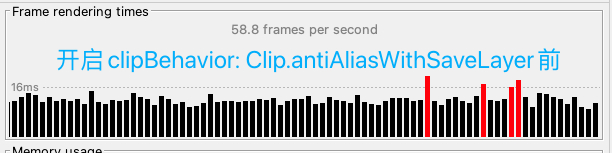
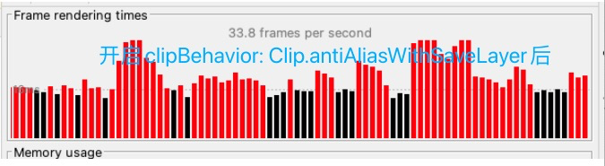

# 第2节：离屏渲染优化

### 离屏渲染（Off-screen rendering）是指在屏幕之外或独立于屏幕渲染的一个过程，它通常发生在图形硬件加速的图形绘制中。离屏渲染在某些情况下是必要的，但也可能会对性能产生负面影响，因此需要谨慎使用。

以下是一些关于离屏渲染的要点：

### 什么情况下会发生离屏渲染？ 以下情况可能发生离屏渲染：

1. 某个Widget的透明度（alpha）小于1，这需要在一个单独的缓冲区中合成图像，然后再将其合并到屏幕上。
2. 使用了图层效果（如阴影）。
3. 使用了某些混合模式或遮罩。

### 为什么需要离屏渲染？ 
离屏渲染的目的是允许在屏幕上显示复杂的视觉效果和图形效果，这些效果可能不容易直接在屏幕上绘制。它提供了更灵活的图形处理能力，使得开发者可以创建更丰富的UI体验。

### 离屏渲染的性能影响：

离屏渲染会增加图形渲染的复杂性，因此可能对性能产生负面影响。离屏渲染通常需要额外的内存和计算资源，因此在不必要的情况下过度使用离屏渲染可能会导致应用程序性能下降，尤其是在移动设备上。

### 如何优化离屏渲染： 为了优化性能，开发者可以采取以下措施：

1. 避免不必要的离屏渲染。只在必要的情况下才使用透明度、混合模式和图层效果等。

2. 尽量避免频繁的动画和变换，因为它们可能触发不必要的离屏渲染。

3. 如果避免不了离屏渲染，尽可能将其限制在更小的区域。

### 小实验

将代码中MaterialApp的checkerboardOffscreenLayers参数设置为true,开启离屏渲染标记开启运行以下代码，观察dev tool中的帧火焰图 中的帧率

  
点我展查看代码

<pre><code>
class _State extends State<StatefulWidget> {
  @override
  void initState() {
    super.initState();
    Timer.periodic(const Duration(milliseconds: 17), (timer) {
      // print('timer:$timer');
      setState(() {});
    });
  }
  @override
  Widget build(BuildContext context) {
    return GridView.builder(
      gridDelegate: const SliverGridDelegateWithFixedCrossAxisCount(
        crossAxisCount: 3, // 每行显示3个方格
        crossAxisSpacing: 5.0, // 横向间距为5
        mainAxisSpacing: 5.0, // 纵向间距为5
      ),
      itemBuilder: (BuildContext context, int index) {
        // 创建蓝色方格
        return Container(
          padding: const EdgeInsetsDirectional.all(20),
          color: Colors.green,
          child: ClipOval(
            key:UniqueKey(),
            // clipBehavior: Clip.antiAliasWithSaveLayer,
            child: Opacity(
              opacity: 0.8,
              child: Container(
                color: Colors.red,
              ),
            ),
          ),
        );
      },
      itemCount: 50, // 总共有50个方格
    );
  }
}
</code></pre>

在手机上运行App，并观察火焰图上面的帧率然后将clipBehavior: Clip.antiAliasWithSaveLayer这一行打开，再观察火焰图上的帧率

​							                             图一   离屏渲染出的界面
##### 以下是我在小米Mi6X手机上测得的帧率

​											图二 非离屏渲染的帧率

​											 图三 离屏渲染的帧率

同时，开启了clipBehavior: Clip.antiAliasWithSaveLayer的区域会被显示为棋盘格，并闪烁，标识是离屏渲染的区域

Tips：其实离屏渲染(saveLayer)对性能的消耗并不像我想象中的多，图中是每帧同时渲染了50个离屏渲染造成的性能差别，如果一帧中只做一个区域的离屏渲染，其实也很难看出差别。所以离屏渲染对性能的损耗大多数情况下是轻微的。

## 小测验

#### 1.下列说法正确的是( )

A. 透明度小于1的Opacity widget 一定会导致离屏渲染

B. Clip开头widget,如ClipRRect,如果裁剪圆角的话，一定会导致离屏渲染

C. 透明度小于1的Opacity widget和裁剪圆角的ClipRRect都不一定导致离屏渲染，

D.RepaintBoundary包裹的widget一定会发生离屏渲染

 
点击查看答案解析

选C
官方文档提到Opacity可能会导致调用saveLayer(即offscreenRender),而Clip 组件只有在指定
clipBehavior: Clip.antiAliasWithSaveLayer的时候才有可能发生离屏渲染
D.选项,如果RepaintBoundary是根节点会触发离屏渲染吗？显然不会。实际上，离屏渲染却一定会导致repaint,因为渲染一定会需要经过paint这个步骤

#### 2. 下列关关于layer树与光栅化的说法，正确的是( )

A. 每一个layer对应一次光栅化过程

B. 每一个Containerlayer对应一次光栅化过程

C.光栅化过程是由CPU完成的

D.每一帧只对应一颗layer树,一颗layer树可能要进行多次光栅化过程。

 
点击查看答案解析

选 D
一个flutterApp只能产生唯一一颗layer树,所以每一帧当然也只有一颗layer树
但是,如果layer树总存在导致离屏渲染的widget,如半透明、裁剪、阴影等，那就要进行多次光栅化了。因为每一次离屏渲染就是一次光栅化的过程

