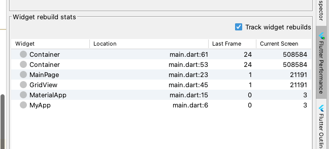

# 第1节：widget重建优化

本文中的重建指的是调用构造函数生成一个对象，widget重建指的就是调用widget构造函数生成一个对象。

widget 重建由于只是对需求的描述，如果其不会引起element重建的话，性能开销还是非常小的。

1.debug模式下，在android studio 的flutter perfomance 视图中勾选"Track widet rebuilds"可以实时追踪widget的重建次数。

##### 1. 能够合法地被const 修饰的widget构造函数的调用生成的widget对象不会被重建。例如const SizedBox()。
##### 2. 对于不能被const修饰的widget构造函数调用生成的widget对象，可以用全局变量或其他不会在某段时间中销毁的变量引用起来，做一个懒加载处理，复用这个widget，避免重建
