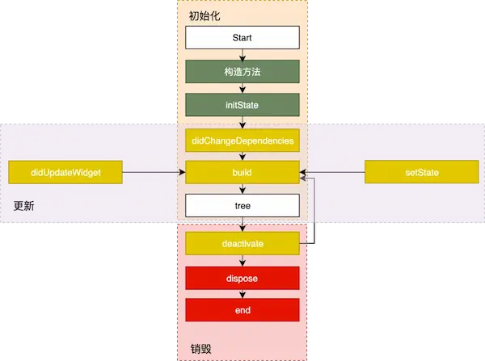
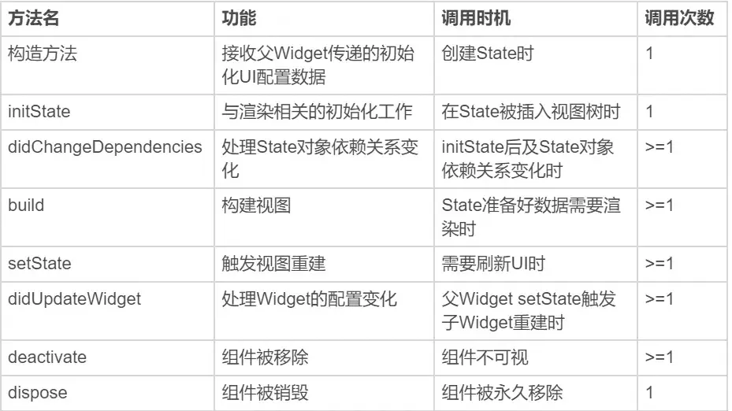

# 1. State生命周期|StatefulWidget 组件的生命周期

State的生命周期可以分为4个阶段：初始化, 创建（插入视图树）、更新（在视图树中存在）、销毁（从视图树中移除)

1. createState
    createState 是 StatefulWidget 里创建 State 的方法，当要创建新的 StatefulWidget 的时候，会立即执行 createState，而且只执行一次，createState 必须要实现

2 .initState()：Widget 初始化当前 State，在当前方法中是不能获取到 Context 的，如想获取，可以试试 Future.delayed()
 initState 是 StatefulWidget 创建完后调用的第一个方法，而且只执行一次，类似于 Android 的 onCreate、IOS 的 viewDidLoad()，所以在这里 View 并没有渲染，但是这时 StatefulWidget 已经被加载到渲染树里了
 构造方法是State生命周期的起点，Flutter会通过调用StatefulWidget.createState() 来创建一个State。我们可以通过构造方法，来接收父Widget传递的初始化UI配置数据。这些配置数据，决定了Widget最初的呈现效果。
 initState，会在State对象被插入视图树的时候调用。这个函数在State的生命周期中只会被调用一次，所以我们可以在这里做一些初始化工作，比如为状态变量设定默认值。

3. didChangeDependencies()：在 initState() 后调用，State对象依赖关系发生变化的时候也会调用。

4. didChangeDependencies则用来专门处理State对象依赖关系变化，会在initState() 调用结束后，被Flutter调用。

### 2. build

**在 StatefulWidget 第一次创建的时候，build 方法会在 didChangeDependencies 方法之后立即调用，另外一种会调用 build 方法的场景是，每当 UI 需要重新渲染的时候，build 都会被调用，所以 build 会被多次调用，然后 返回要渲染的 Widget。千万不要在 build 里做除了创建 Widget 之外的操作，因为这个会影响 UI 的渲染效率。**

build，作用是构建视图。经过以上步骤，Framework认为State已经准备好了，于是调用build。我们需要在这个函数中，根据父Widget传递过来的初始化配置数据，以及State的当前状态，创建一个Widget然后返回
 deactivate()：当 State 被暂时从视图树中移除时会调用这个方法，页面切换时也会调用该方法，和Android里的 onPause 差不多。
 dispose()：Widget 销毁时调用。
 didUpdateWidget：Widget 状态发生变化的时候调用。

### 3. didChangeDependencie与didUpdateWidget的作用

### 5. App生命周期监听AppLifecycleListener

在Flutter中，我们可以利用WidgetsBindingObserver监听 各种变化
 WidgetsBindingObserver源码分析:

~~~
abstract class WidgetsBindingObserver {
  // 页面 pop
  Future<bool> didPopRoute() => Future<bool>.value(false);
  // 页面 push
  Future<bool> didPushRoute(String route) => Future<bool>.value(false);
  // 系统窗口相关改变回调，如旋转
  void didChangeMetrics() { }
  // 文本缩放系数变化
  void didChangeTextScaleFactor() { }
  // 系统亮度变化
  void didChangePlatformBrightness() { }
  // 本地化语言变化
  void didChangeLocales(List<Locale> locale) { }
  //App 生命周期变化
  void didChangeAppLifecycleState(AppLifecycleState state) { }
  // 内存警告回调
  void didHaveMemoryPressure() { }
  //Accessibility 相关特性回调
  void didChangeAccessibilityFeatures() {}
}
~~~

**WidgetsBindingObserver这个类提供的回调函数非常丰富，常见的屏幕旋转、屏幕亮度、语言变化、内存警告都可以通过这个实现进行回调**

  1.生命周期回调

didChangeAppLifecycleState回调函数中，有一个参数类型为AppLifecycleState的枚举类，这个枚举类是Flutter对App生命周期状态的封装。它的常用状态包括resumed、inactive、paused这三个。
 resumed：可见的，并能响应用户的输入。
 inactive：处在不活动状态，无法处理用户响应。
 paused：不可见并不能响应用户的输入，但是在后台继续活动中
 我们试着切换一下前、后台，观察控制台输出的App状态，可以发现：
 从后台切入前台，控制台打印的App生命周期变化如下: AppLifecycleState.paused->AppLifecycleState.inactive->AppLifecycleState.resumed；
 从前台退回后台，控制台打印的App生命周期变化则变成了：AppLifecycleState.resumed->AppLifecycleState.inactive->AppLifecycleState.paused。

2. 新版本生命周期回调: AppLifecycleListener

生命周期图2:
 就像activity和fragment一样的!
 优点: AppLifecycleListener 的好处就是不用 mixin ，并且通过回调可以判断生命周期链条。
 AppLifecycleState 中的状态包括：
 detached:但是视图并不存在，例如没有 FlutterView ，Flutter 初始化之前所处的默认状态。
 resumed :表示 App 处于具有输入焦点且可见的正在运行的状态。
 inactive: App 至少一个视图是可见的，但没有一个视图具 Focus。 (被其他app档在前面了)
 paused:App 当前对用户不可见，并且不响应用户行为。
 detached 四种。
 则是在 WidgetsBindingObserver.didChangeAppLifecycleState 的基础上进行了封装，再配合当前 lifecycleState 形成更完整的生命周期链条，对于开发者来说就是使用更方便，并且 API 相应更直观。

2 . 帧绘制回调

而在Android开发中，我们可以通过View.post()插入消息队列，来保证在组件渲染后进行相关操作。
 ，在Flutter中实现同样的需求会更简单：依然使用万能的WidgetsBinding来实现。
 WidgetsBinding提供了单次Frame绘制回调，以及实时Frame绘制回调两种机制，来分别满足不同的需求：
 单次Frame绘制回调，通过addPostFrameCallback实现。它会在当前Frame绘制完成后进行进行回调，并且只会回调一次，如果要再次监听则需要再设置一次。

~~~
WidgetsBinding.instance.addPostFrameCallback((_){
    print(" 单次 Frame 绘制回调 ");// 只回调一次
  });
~~~

实时Frame绘制回调，则通过addPersistentFrameCallback实现。这个函数会在每次绘制Frame结束后进行回调，可以用做FPS监测。

~~~
WidgetsBinding.instance.addPersistentFrameCallback((_){
  print(" 实时 Frame 绘制回调 ");// 每帧都回调
});
~~~

参考:[5.flutte3.0 遥遥领先系列|一文教你完全掌握生命周期(lifecycle) - 简书 (jianshu.com)](https://www.jianshu.com/p/a8b9e394a641)
